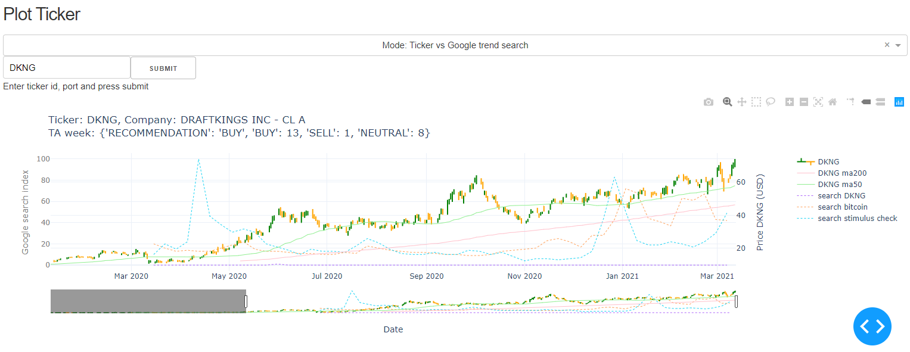

#  ARK invest ETF holdings Tracker

## 1. What it is

A Dashbord that track ARK Invests holdings. Get inspiration by following how they manage their innovative ETFs.
- ARK_FINTECH_INNOVATION_ETF_ARKF_HOLDINGS
- ARK_GENOMIC_REVOLUTION_MULTISECTOR_ETF_ARKG_HOLDINGS
- ARK_INNOVATION_ETF_ARKK_HOLDINGS
- ARK_AUTONOMOUS_TECHNOLOGY_&_ROBOTICS_ETF_ARKQ_HOLDINGS
- ARK_NEXT_GENERATION_INTERNET_ETF_ARKW_HOLDINGS
- ARK_ISRAEL_INNOVATIVE_TECHNOLOGY_ETF_IZRL_HOLDINGS
- THE_3D_PRINTING_ETF_PRNT_HOLDINGS

E.g new holdings and where they increase/ decrease shares.

## 2. How to install and run

1. Download/ Clone project folder
2. Make sure you have Python installed
3. Create a virtual environment (optional)
4. Install requirements (pip install -r requirements.txt)
5. Open terminal and cd to folder (where you downlodaed project)
6. run app.py (by typing 'python app.py)
7. Open your browser and type localhost:8050

Enjoy :)

As long as the app is running it will autoatically download Ark holdings every hour.

## 3. What the Dashboard looks like

- --> See the umber of hodings per ETF fund
- --> The function behind this graph also automatically download holding info from ARK website

### Plot Holdings Weights

- --> Plot the holdings weights for a specific fund or all funds combined
- --> Select time frame and weight threshold

### Plot Holdings Changes

- --> Plot the holdings changes for a specific fund or all funds combined
- --> Select time frame

### Plot Ticker

- --> Select and plot a ticker
- --> Get TA recommendation (via trading view API)
- --> See google trend search on same time line

## Thanks to parttime Larry
For inspiration, awesome video tuturials and coding examples
https://hackingthemarkets.com/
